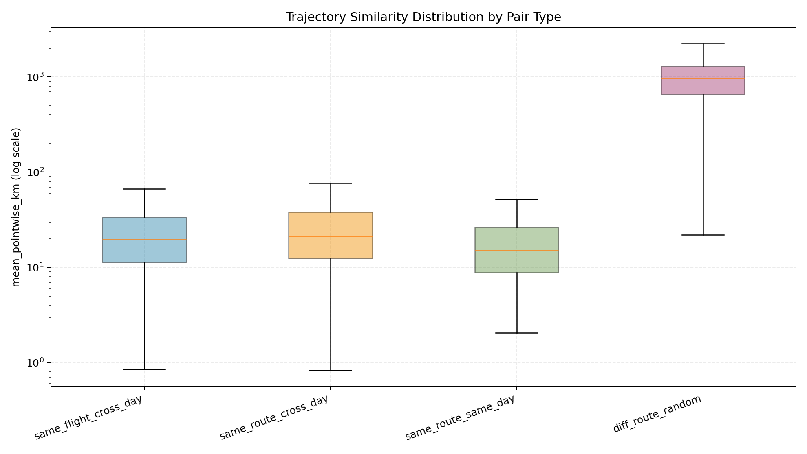
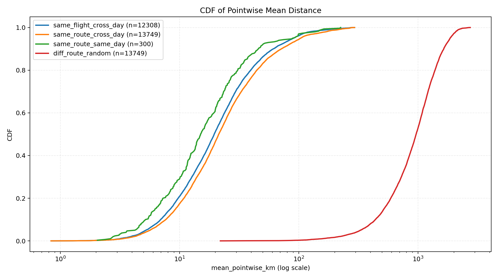
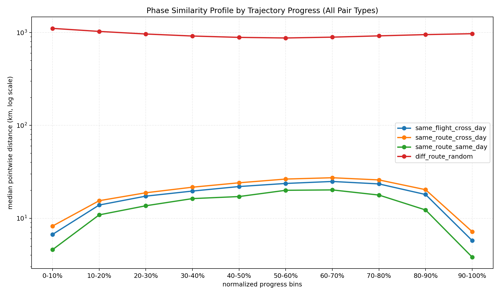
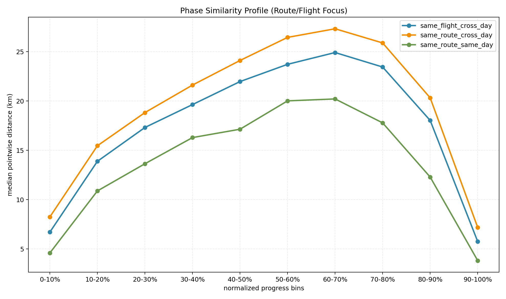
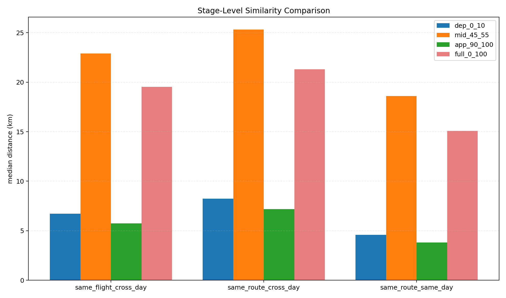

# 跨天同航线轨迹相似度研究报告（README）

## 文档导航

- 学术长版报告：`analysis/same_route_similarity/REPORT_ACADEMIC.md`
- 1 页决策简报：`analysis/same_route_similarity/DECISION_BRIEF.md`
- 本文件：工程导读与结果主文档

## 摘要
本文针对 `opensky_2024_PRC_dataset/interpolated_clean_eu_v5` 进行了“同航班/同航线跨天轨迹相似度”评估，目的在于回答以下问题：

1. 同一航班（`callsign+adep+ades`）跨天是否足够相似，能否作为小模型参考记忆。
2. 同一航线（`adep+ades`）跨天是否已经提供主要相似性信息。
3. 相似性是否在飞行阶段上不均匀（例如降落段更相似）。

核心结论：

1. 同航班跨天与同航线跨天都显著优于随机异航线。
2. 同航班跨天仅比同航线跨天小幅更相似（中位约 8.3% 优势），不是数量级差异。
3. 相似性呈明显“首尾高、中段低”结构，降落段和起飞段显著更相似。

## 数据与实验范围

- 轨迹数据目录：`opensky_2024_PRC_dataset/interpolated_clean_eu_v5`
- 元数据：`opensky_2024_PRC_dataset/flights/challenge_set.parquet`
- 本次可用时间窗：`2022-01-01` 到 `2022-02-28`（59 天）
- 轨迹关联键：`interpolated.original_flight_id -> challenge_set.flight_id`

抽样配置（默认）：

- 路线筛选：`min_route_days=10`，`min_route_flights=20`
- 路线上限：`max_routes=250`
- 每条航线每天抽样：最多 2 架次
- 每条航线总抽样：最多 24 架次
- 重采样点数：200

有效样本规模：

- 采样航班：6000
- 有效重采样轨迹：3671
- Pair 数：40106

## 方法

### 1. 轨迹标准化

对每条轨迹按时间归一化进度 `p in [0,1]` 重采样到 200 点，然后进行逐点比较。

### 2. Pair 分类

- `same_flight_cross_day`：同 `callsign+adep+ades` 且不同天
- `same_route_cross_day`：同 `adep+ades` 且不同天
- `same_route_same_day`：同 `adep+ades` 且同天
- `diff_route_random`：不同航线随机配对

### 3. 指标定义

- `mean_pointwise_km = mean(d_i)`
- `p95_pointwise_km = quantile_95(d_i)`
- `alt_rmse_km = sqrt(mean((alt1_i - alt2_i)^2)) / 1000`
- `normalized_mean_dist = mean_pointwise_km / average(path_len_1, path_len_2)`

其中 `d_i` 为第 `i` 个归一点位上的 Haversine 球面距离。

## 运行方式

环境要求：

```bash
conda activate opensky
```

步骤 1，主分析：

```bash
conda run --no-capture-output -n opensky python \
  analysis/same_route_similarity/evaluate_same_route_similarity.py \
  --interp-dir opensky_2024_PRC_dataset/interpolated_clean_eu_v5 \
  --meta-parquet opensky_2024_PRC_dataset/flights/challenge_set.parquet \
  --output-dir analysis/same_route_similarity/output \
  --workers 14
```

步骤 2，阶段分析与图：

```bash
conda run --no-capture-output -n opensky python \
  analysis/same_route_similarity/analyze_phase_similarity.py \
  --interp-dir opensky_2024_PRC_dataset/interpolated_clean_eu_v5 \
  --selected-flights-csv analysis/same_route_similarity/output/selected_flights.csv \
  --pairwise-csv analysis/same_route_similarity/output/pairwise_metrics.csv \
  --output-dir analysis/same_route_similarity/output \
  --workers 14
```

步骤 3，单样本诊断（高亮指定 `t_start~t_end` 时间窗）：

```bash
conda run --no-capture-output -n opensky python \
  analysis/same_route_similarity/analyze_single_target_same_flight.py \
  --source-file opensky_2024_PRC_dataset/interpolated_clean_eu_v5/interpolated_2022-01-30.parquet \
  --flight-id 2492626310092 \
  --t-start 2022-01-30T09:26:47Z \
  --t-end 2022-01-30T09:37:27Z \
  --interp-dir opensky_2024_PRC_dataset/interpolated_clean_eu_v5 \
  --meta-parquet opensky_2024_PRC_dataset/flights/challenge_set.parquet \
  --output-dir analysis/same_route_similarity/output \
  --workers 14
```

单样本图例说明（`target_<flight_id>_top_refs_overlay*.png`）：

- 黑色线：目标轨迹全程。
- 红色加粗线：用户传入的 `t_start~t_end` 查询时间窗（本次重点关注段）。
- 紫色虚线：目标轨迹最后 10%（`90-100%`），用于进近段参考对照。

步骤 4，一键运行（推荐，参数集中在脚本顶部）：

```bash
bash analysis/same_route_similarity/run_single_target_analysis.sh
```

脚本文件：`analysis/same_route_similarity/run_single_target_analysis.sh`

可调参数全部在脚本顶部，包括：

- `SOURCE_FILE`
- `FLIGHT_ID`
- `T_START`
- `T_END`
- `INTERP_DIR`
- `META_PARQUET`
- `OUTPUT_DIR`
- `RESAMPLE_POINTS`
- `MIN_TRAJ_POINTS`
- `TOP_K_WINDOW`
- `TOP_K_APP95`
- `WORKERS`
- `CONDA_ENV`

## 结果一：全局相似度对比

数据文件：`analysis/same_route_similarity/output/pair_type_summary.csv`

| Pair 类型 | 样本数 | mean 中位 (km) | mean P10 (km) | mean P90 (km) | p95 中位 (km) | alt_rmse 中位 (km) | normalized mean 中位 |
|---|---:|---:|---:|---:|---:|---:|---:|
| same_flight_cross_day | 12308 | 19.538 | 6.952 | 61.111 | 38.314 | 2.417 | 0.0245 |
| same_route_cross_day | 13749 | 21.308 | 7.667 | 71.510 | 41.952 | 2.609 | 0.0265 |
| same_route_same_day | 300 | 15.068 | 5.430 | 45.876 | 31.713 | 2.287 | 0.0207 |
| diff_route_random | 13749 | 963.807 | 439.477 | 1643.846 | 1380.885 | 8.411 | 0.9678 |

解释：

1. 同航班跨天和同航线跨天都远小于随机异航线（数量级差距）。
2. 同航班跨天优于同航线跨天，但优势有限：`19.538 vs 21.308 km`（约 8.3%）。
3. 同航线同天最相似，符合运行日内一致性预期。

配图：





## 结果二：最相似样例与“可用参考”上限

数据文件：`analysis/same_route_similarity/output/best_pair_examples.csv`

| Pair 类型 | best mean (km) | best p95 (km) | route | 日期对 |
|---|---:|---:|---|---|
| same_flight_cross_day | 0.849 | 1.581 | ESGG\|EKCH | 2022-02-04 vs 2022-01-25 |
| same_route_cross_day | 0.836 | 1.433 | ESGG\|EKCH | 2022-02-19 vs 2022-02-15 |

解释：

1. “最像”样本可以达到 1km 量级。
2. 但这是极值，不代表整体分布；总体中位仍在 20km 左右。

## 结果三：航线级差异（跨天）

数据文件：

- `analysis/same_route_similarity/output/route_level_quantiles.csv`
- `analysis/same_route_similarity/output/route_level_threshold_ratios.csv`

航线中位相似度分位：

- P10: 11.189 km
- P25: 16.010 km
- P50: 21.781 km
- P75: 36.653 km
- P90: 66.237 km
- P95: 98.734 km

阈值占比（航线中位 `<= threshold`）：

- `<= 10 km`: 5.82%
- `<= 15 km`: 23.81%
- `<= 20 km`: 43.92%
- `<= 30 km`: 67.72%

解释：航线间稳定性差异很大，构建参考库时应做航线质量分层。

## 结果四：阶段相似性（重点）

数据文件：

- `analysis/same_route_similarity/output/phase_similarity_summary.csv`
- `analysis/same_route_similarity/output/phase_profile_by_progress.csv`
- `analysis/same_route_similarity/output/takeoff_landing_segment_summary.csv`

### 4.1 阶段中位比较

| Pair 类型 | 全程中位 (km) | 起飞 0-10% (km) | 中段 45-55% (km) | 进近 90-100% (km) | 进近/全程比 |
|---|---:|---:|---:|---:|---:|
| same_flight_cross_day | 19.538 | 6.707 | 22.895 | 5.749 | 0.312 |
| same_route_cross_day | 21.308 | 8.248 | 25.310 | 7.177 | 0.312 |
| same_route_same_day | 15.068 | 4.592 | 18.598 | 3.818 | 0.228 |

### 4.2 起飞/降落细分（跨天）

| Pair 类型 | 起飞 0-5% (km) | 起飞 0-10% (km) | 进近 95-100% (km) | 全程中位 (km) | 0-5%/全程 | 95-100%/全程 |
|---|---:|---:|---:|---:|---:|---:|
| same_flight_cross_day | 3.278 | 6.707 | 2.460 | 19.538 | 0.168 | 0.126 |
| same_route_cross_day | 4.493 | 8.248 | 3.130 | 21.308 | 0.211 | 0.147 |

关键观察：

1. 你的判断成立：降落段更相似。
2. 起飞段也明显更相似（低于全程很多），并非只有降落段。
3. 中段最不相似，说明航路段受绕飞、风场、ATC、机型策略影响更大。

配图：







## 对深度学习模型的启发（综述）

### 1. 关于“同航班记忆”是否值得

- 值得，但不应单独依赖。
- 同航班跨天仅比同航线跨天略优，不是决定性差距。

### 2. 更可行的记忆检索结构

推荐采用“两级检索 + 阶段感知加权”：

1. 一级检索：按 `adep+ades`（同航线）召回候选历史轨迹。
2. 二级重排：按同航班标签、起降段匹配度、天气/风场上下文进行重排。
3. 阶段加权：训练损失或检索权重对 `0-10%`、`90-100%` 给更高权重，对中段给较低权重。

### 3. 小模型容量友好策略

- 先压缩“航线原型库”（route prototypes），减少记忆规模。
- 再保留“同航班高质量残差样本”（相对航线原型偏差小的样本）。
- 在线推理时可按航段动态切换参考权重。

## 局限与风险

1. 当前轨迹窗口仅覆盖 2022-01 到 2022-02，季节性与长期调度变化未完全覆盖。
2. 轨迹按归一化时间对齐，不等价于“按航迹弧长对齐”或“按飞行阶段事件点对齐”。
3. 未显式引入天气、跑道使用、流控、机型重量等外生变量。

## 后续建议

1. 增加“按弧长/航程归一化”与“按进近门限点对齐”的对照实验。
2. 将天气和机场运行状态作为检索键，测试是否降低中段离散度。
3. 建立“高稳定航线白名单”，优先用于小模型记忆蒸馏。

## 主要产物清单

- 脚本：`analysis/same_route_similarity/evaluate_same_route_similarity.py`
- 脚本：`analysis/same_route_similarity/analyze_phase_similarity.py`
- 脚本：`analysis/same_route_similarity/analyze_single_target_same_flight.py`
- 脚本：`analysis/same_route_similarity/run_single_target_analysis.sh`
- 明细：`analysis/same_route_similarity/output/pairwise_metrics.csv`
- 明细：`analysis/same_route_similarity/output/phase_pair_metrics.csv`
- 汇总：`analysis/same_route_similarity/output/pair_type_summary.csv`
- 汇总：`analysis/same_route_similarity/output/phase_similarity_summary.csv`
- 汇总：`analysis/same_route_similarity/output/phase_profile_by_progress.csv`
- 汇总：`analysis/same_route_similarity/output/takeoff_landing_segment_summary.csv`
- 汇总：`analysis/same_route_similarity/output/best_pair_examples.csv`
- 图：`analysis/same_route_similarity/output/figures/*.png`
