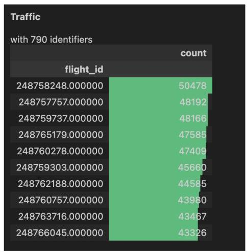
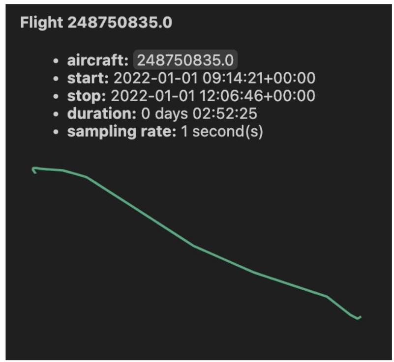
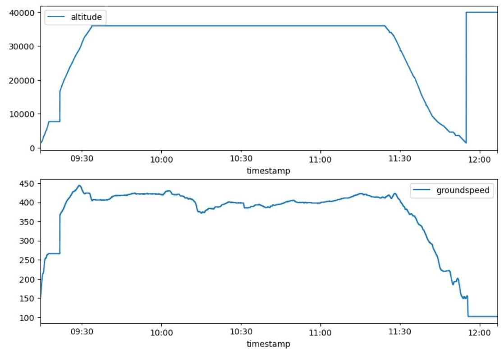

## 2 Data

The participating teams will have access to two S3 buckets as follows:

---

competition-data/

	- ...

submissions/

- ...

---

The competition-data bucket contains the data for modeling, while submissions holds the teams' submission for ranking. The submissions will not show up when listing the buckets with a team's account, nevertheless it is present for submission and ranking, see the Ranking section.

## Data for modeling

Attention

## Updated trajectories on 9th Oct 2024

9thth Oct 2024: trajectory files have been re-extracted (again) for the whole 2022.

We haven't filtered against OSN flight list but retrieved all that is available for the relevant flights (and more to be frank).

Please consider re-downloading them.

## Updated trajectories on 24th Sep 2024

24th Sep 2024: trajectory files have been reprocessed (weird constant altitudes and midnight crossing issues). Please consider re-downloading them.

16th Aug 2024: challenge_set.csv now contains fixes for tow originally below minimum mass for the relevant aircraft types.

Please consider re-downloading it.

We propose two data sets:

1. a flight list of (a subset of) flights (partially) flown in Europe in 2022

2. the relevant trajectories for the above flights as recorded/processed by OpenSky Network (OSN) (note: few thousand flights have no trajectory available)

The data sets for the challenge are organized as follows:

---

competition-data/

		— 2022-01-01.parquet

		— 2022-01-02.parquet

- ...

	- challenge_set.csv

		- final_submission_set.csv # <-- only 1 week before deadline

L submission_set.csv

---

Each daily trajectory parquet file contains (Automatic Dependent Surveillance-Broadcast (ADS-B) based) flown trajectories augmented with meteorological information \( {}^{1} \) .

The S3 bucket competition-data contains

1. the flight list, challenge_set.csv

2. the daily trajectories, 2022-01-01.parquet, 2022-01-02.parquet, ...

3. the submission set, submission_set.csv (and final_submission_set.csv only 1 week before deadline, see Rankings)

## Flight List

The flight list consists of 369013 flights departed/arrived in Europe in 2022. It provides details such as (column names in parenthesis, [units] in italic in square brackets when appropriate):

- flight identification: unique ID (flight_id), (obfuscated) callsign (callsign)

- origin/destination: Aerodrome of DEParture (ADEP) ( adep [ICAO code]), Aerodrome of DEStination (ADES) (ades [/CAO code]) and ancillary info, i.e. airport name ( name_adep, name_ades ) and country code ( country_code_adep, country_code_ades [/SO2C])

- timing: date of flight (date [/SO 8601 UTC date]), Actual Off-Block Time (AOBT)

(actual_offblock_time [ISO 8601 UTC date and time]), ARriVal Time (ARVT) (arrival_time [ISO 8601 UTC date and time)

- aircraft: aircraft type code (aircraft_type [ICAO aircraft type]), Wake Turbulence Category (WTC) (wtc)

- airline: (obfuscated) Aircraft Operator (AO) code (airline),

- operational values: flight duration (flight_duration [min]) , taxi-out time (taxiout_time [min]), route length (flown_distance [nmi]) , (estimated) TakeOff Weight (TOW) (tow [kg])

## Further info material:

- Airport codes, and more: OurAirports, OA on Observable

- ISO 2-character country codes: ISO2C

- (meaningful) Time and dates formats: ISO 8601

- ICAO aircraft type designator, WTC and more: ICAO aircraft type designator page

## Trajectory

The trajectories for the flight list for modeling and the ones for ranking are provided as daily .parquet files amounting to around 158 GiB of (max) 1 second position reports out of ADS-B data collected and processed by OSN. (note: few thousand flights have no trajectory available)

The daily trajectory files contain:

- flight identification: unique ID (flight_id, same as for flight list), (obfuscated) ICAO 24-bit address (icao24, same value as flight_id)

- 4D position: longitude [DD, decimal degrees in -180/180 range] and latitude [DD, decimal degrees in -90/90 range], altitude [ft], timestamp [timestamp with time zone]

- speed: ground speed ( groundspeed [ kt ]), track angle ( track and track_unwrapped [decimal degrees]), vertical rate of climb/descent (vertical_rate [ft/min])

- (optionally) meteorological info at 4D position:

- wind (u_component_of_wind and v_component_of_wind [m/s])

- temperature [K, kelvin]

The daily file <yyyy-mm-dd>.parquet includes all position reports on (UTC) <yyyy-mm-dd> date; it can happen that flight portions be present in consecutive files, i.e. the same flight_id will occur in more than one daily file because the flight took place across the (UTC) midnight.

NOTE: trajectories are not necessarily complete/overlapping with respect to what reported in the flight list in actual_offblock_time or arrival_time. This is due to the possibly limited/partial ADS-B coverage in some parts (or some lower altitudes) of the world. The interval [actual_offblock_time + taxiout_time, arrival_time] is a good approximation of the in-the-air portion of the flight.

Further info material:

- Track in aviation: SkyBrary page

- Ground speed: SkyBrary_page

## Rationale for the data sets

Our gut feelings say that Actual TakeOff Weight (ATOW) depends in some forms from:

- origin/destination: the great circle distance is of course a factor in terms of how much fuel you will have to tank and hence the take-off weight.

ADEP or ADES are important because of specific local procedures.

ADEP/ADES could also be important because different AOs plan and execute flights differently from/to the same airport.

- timing: when you execute a flight, i.e. morning/evening/night, weekly patterns, seasonal trends (IATA season schedule \( {}^{2} \) ), local time (?), flight duration calculation, could be a factor to consider

- aircraft: the (ICAO) type \( {}^{3} \) will imply different amounts of fuel needed,

- airline: policies varies, for example for same city-pair one airline could select different alternates from another airline depending on their technical support facilities/contracts. Also AOs have different tanking policies.

- operational: flown route length (different from great circle distance) could better refine ATOW estimation; same for taxi-out duration

- trajectory: The ADS-B trajectory can help to classify the way a flight has been flown (rate of climb/descent, maximum en-route flight level, ...) and hence refine the ATOW estimate.

## Dataset for submission

---

	## Attention

Refreshed submission_set.csv on 8th Aug 2024

submission_set.csv now contains all columns and not just flight_id and tow.

---

The submission file, competition-data/submission_set.csv, contains a flight list for which to estimate the TOW; it has the same columns as the flight list (but of course empty tow.)

The relevant trajectories associated to the flight_id 's are part of the ones provided in the Trajectory dataset.

## Where/How to get the Datasets

The dataset files are hosted on OSN infrastructure.

Upon registration of your team you should have received the relevant

- team name and ID

- BUCKET_ACCESS_KEY and BUCKET_ACCESS_SECRET.

something like

---

\{

	"team_name": "team_warm_donkey",

	"team_id": "b8e3a438-d2f2-4a11-bf28-e7a8f84cf3db",

	"bucket_access_key": "blah",

	"bucket_access_secret": "blahblah"

\}

---

Below you can find the details on how to access the data sets and submit your results for ranking.

## Using MinIO Client

## Pre-requisites

The steps below have been executed on a MBR/macOS machine but it should be easy to apply them to other Unix-like environments (we did similarly on MS Windows via Git Bash.)

1. Install MinIO Client for your OS/environment:

---

\$ brew install minio/stable/mc

---

2. Set an alias up for the challenge data location:

---

\$ mc alias set dc24 \\

	https://s3.opensky-network.org/ \\\\

	ACCESS_KEY SECRET_KEY

---

where ACCESS_KEY is the value of bucket_access_key and SECRET_KEY the one of

bucket_access_secret.

## Read/Write data

From the command line you can 1. list the competition buckets

---

\$ mc ls dc24

	[2024-07-05 04:05:29 CEST] 0B competition-data/

---

2. list the content of the (read-only) competition-data/ bucket

---

\$ mc ls dc24/competition-data/

	[2024-07-10 10:58:23 CEST] 12MiB STANDARD 2022-01-01.parquet

	[2024-07-10 10:58:34 CEST] 19MiB STANDARD 2022-01-02.parquet

	...

	[2024-07-11 12:41:20 CEST] 164MiB STANDARD challenge_set.csv

		[2024-07-11 12:42:43 CEST] 1.1MiB STANDARD submission_set.csv

---

3. copy Jan 2022 trajectory files from the (read-only) competition-data/ bucket to a local directory

---

\$ mc cp --recursive dc24/competition-data/2022-01 my-local-directory/

---

4. copy all files from the (read-only) competition-data/ bucket to a local directory

\$ mc cp --recursive dc24/competition-data/ my-local-directory/

## Using Python

## Pre-requisites

You need to have pyopensky installed as detailed here.

Also your configuration files should contain the relevant values for ACCESS_KEY and SECRET_KEY as explained above.

[default]

---

username = your_osn_user

password = ...

access_key = ACCESS_KEY

secret_key = SECRET_KEY

---

## Read/Write Data

The following code allows to download the challenge files

---

from pyopensky.s3 import S3Client

s3 = S3Client(   )

for obj in s3.s3client.list_objects("competition-data", recursive=True):

	print(f"\{obj.bucket_name=\}, \{obj.object_name=\}")

	s3.download_object(obj)

---

## Using traffic for Exploratory Data Analysis

You can explore the trajectory data using the traffic library in a Python notebook.

For example you can load one of the daily trajectory files

---

import warnings

from tqdm import TqdmExperimentalWarning

warnings.filterwarnings("ignore", category=TqdmExperimentalWarning)

warnings.filterwarnings("ignore", category=FutureWarning)

import matplotlib.pyplot as plt

from traffic.core import Traffic

t = (Traffic.from_file("2022-01-01.parquet")

	#smooth vertical glitches

	.filter(   )

	#resample at 1s

	.resample('1s')

	#execute all

	.eval(   )

)

---

plot the list of flights

---

t

---

daily flights a 2D map

---

trj = t[11]

trj

---

map of flight 248750835

and finally a vertical profile with ground speed:

---

fig, (ax1, ax2) = plt.subplots(2, 1, figsize=(10, 7))

	flight = t[11]

	flight.plot_time(ax=ax1, y="altitude")

	flight.plot_time(ax=ax2, y="groundspeed")

	plt.show(   )

---

vertical profile of flight 248750835

Note: the vertical profile for flight 248750835 shows that you should probably have considered only the [actual_offblock_time + taxiout_time, arrival_time] interval if interested in the in-the-air portion of

the flight, i.e. cut the final portion at 2022-01-01T11:55:15Z (and not that there is no very low altitude data from the takeoff).

## Ranking

The submission bucket is organized as follows (teams' accounts won't be able to list this bucket contents):

---

submissions/

— team_warm_donkey_v1_b8e3a438-d2f2-4a11-bf28-e7a8f84cf3db.csv

— team_warm_donkey_v2_b8e3a438-d2f2-4a11-bf28-e7a8f84cf3db.csv

				— team_zesty_wreath_v1_4eabd02b-1622-44d8-8066-1dccd12bd585.csv

	- ...

---

For ranking you'll need to upload a file with your estimated TOWs (column tow) for all the flight IDs (column flight_id) as present in the competition-data/submission_set.csv. Its content can be as simple as

---

flight_id, tow

258081039, 123

258081111, 456

...

---

NOTE: Missing flight_id rows will get a tow of 0 (zero), as well as empty/null values for tow.

Your submission file needs to be uploaded to the submissions/ bucket in a file named

---

<team_name>_v<num>_<team_id>.csv

---

where you are responsible to increase num accordingly for each of your submissions (dc24 alias as explained above):

---

\$ team_name='team_warm_donkey'

	\$ team_id='b8e3a438-d2f2-4a11-bf28-e7a8f84cf3db'

\$ num=3

	\$ subfile=\$\{team_name\}_v\$\{num\}_\$\{team_id\}.csv

	\$ mc cp ./my_submission.csv dc24/submissions/\$\{subfile\}

---

The ranking job will be automatically run every 30 minutes and will use Root Mean Square Error (RMSE) to compare a submission for the 105959 flights in submission_set.csv with the (hidden) the ground truth.

The final ranking will use an additional 52190 flights. See the Ranking page for more details.

The leaderboard will display the best ranked submissions per team.

Eventually manually reload it, please.

To query for all calculated RMSE's for all submissions, please use https://datacomp.opensky-network.org/api/stats

You can also get a JSON file with the rankings as ( \( \mid \) jq only for pretty printing):

---

\$ curl -X 'GET' \\

		'https://datacomp.opensky-network.org/api/rankings' \\\\

		-H 'accept: application/json' | jq

[

		\{

			"mse": 9752328117.3738,

			"rank": 1,

			"team_name": "team_radiant_xerox",

			"file_version": "v2"

	\},

		\{

			"mse": 9752339084.6523,

			"rank": 2,

			"team_name": "team_bold_xylophone",

			"file_version": "v1"

	\}

]

---

## List of Acronyms

ADEP: Aerodrome of DEParture

ADES: Aerodrome of DEStination

ADS-B: Automatic Dependent Surveillance-Broadcast

AO: Aircraft Operator

AOBT: Actual Off-Block Time

ARVT: ARriVal Time

ATOW: Actual TakeOff Weight

ECMWF: European Centre for Medium-Range Weather Forecasts

OSN: OpenSky Network

RMSE: Root Mean Square Error

TOW: TakeOff Weight

WTC: Wake Turbulence Category 1. from Google's Analysis-Ready, Cloud Optimized (ARCO) ERA5: ERA5 is the fifth generation of the European Centre for Medium-Range Weather Forecasts (ECMWF) Atmospheric Reanalysis, providing hourly estimates of a large number of atmospheric, land, and oceanic climate variables.

The Google Cloud Public Dataset Program hosts ERA5 data that spans from 1940 to recent days, covering the Earth on a \( {30}\mathrm{\;{km}} \) grid and resolves the atmosphere using 137 levels from the surface up to a height of \( {80}\mathrm{\;{km}} \) .

2. IATA Summer schedule for year YYYY begins on the last Sunday of March YYYY and ends on the last Saturday of October YYYY.

IATA Winter schedule for year YYYY begins on the Sunday after the last Saturday of October YYYY and ends on the Saturday before last Sunday of March YYYY + 1.

3. and possibly the engine types/age, but these are unfortunately not included in the Data for modeling dataset.