PRC Data Challenge

Method and Results of Team "Likable Jelly"

Richard Alligier, David Gianazza

Ecole Nationale de l'Aviation Civile

## PRC Data Challenge

Team "Likable Jelly":

Richard Alligier, assistant professor at ENAC

David Gianazza, associate professor at ENAC

## PRC data challenge

Develop an open Machine Learning model to predict Aircraft Take-Off Weight (TOW) based on flight and trajectory data. Provided Files:

, challenge_set.csv and final_submission_set.csv

- flight identification:callsign

origin/destination: DEParture (ADEP), and DEStination (ADES)

timing: date of flight, actual off-block time, arrival time

- aircraft: aircraft type code

- airline: (obfuscated) Aircraft Operator code (airline)

- operational values: flight duration, taxi-out time, flown distance

∎ OpenSky Network’s ADS-B 2022-XX-XX.parquet files

- timestamp, latitude, longitude, altitude, groundspeed, ROCD, T and wind, 2 / 11

## Machine Learning Model: Our Solution

TOW \( = \) model(FlightInfo, WeatherAtAirports, Trajectory)

## model

- LightGBM library; an efficient gradient boosted trees library

- Hyper-parameters:

- Number of boosting iterations (it i.e. number of trees): 50,000

- Random search to select size of the trees and regularization parameters

Input Variables

611 input variables extracted from different sources

## Input Variables

TOW \( = \) model(FlightInfo, WeatherAtAirports, Trajectory)

FlightInfo: challenge_set.csv and final_submission_set.csv

Basic variables from . csv files but we did not use the callsign.

- Added variables:

- Local time of departure/arrival computed from UTC time

- Great circle distance, latitude/longitude from [ourairports.com]

WeatherAtAirport: METARs from

[https://mesonet.agron.iastate.edu/ASOS/]

Temperature and wind at departure and arrival airport

Thunderstorms and fog at the arrival airport

## Input Variables

TOW \( = \) model (FlightInfo, WeatherAtAirports, Trajectory)

Trajectory: OpenSky Network's ADS-B 2022-XX-XX.parquet files

1 ADS-B Trajectory Filtering & Smoothing

2 Features Engineering:

## Input Variables

TOW \( = \) model (FlightInfo, WeatherAtAirports, Trajectory)

Trajectory: OpenSky Network's ADS-B 2022-XX-XX.parquet files

1 ADS-B Trajectory Filtering & Smoothing

2 Features Engineering:

- Wind along trajectory:

Average value of the wind projected onto the ground speed

\[
\text{dot}\left( {\overrightarrow{\text{wind}},\overrightarrow{\text{groundspeed}}}\right) /\parallel \overrightarrow{\text{groundspeed}}\parallel
\]

## Input Variables

TOW \( = \) model (FlightInfo, WeatherAtAirports, Trajectory)

Trajectory: OpenSky Network's ADS-B 2022-XX-XX.parquet files

1 ADS-B Trajectory Filtering & Smoothing

2 Features Engineering:

- Wind along trajectory:

Average value of the wind projected onto the ground speed

\[
\text{dot}\left( {\overrightarrow{\text{wind}},\overrightarrow{\text{groundspeed}}}\right) /\parallel \overrightarrow{\text{groundspeed}}\parallel
\]

- Climb phase:

energyrate \( = \frac{d\text{energy}}{dt} \) , with energy \( = {g}_{0} \) Altitude \( + \frac{1}{2} \) TrueAirSpeed \( {}^{2} \)

## Input Variables

TOW \( = \) model (FlightInfo, WeatherAtAirports, Trajectory)

Trajectory: OpenSky Network's ADS-B 2022-XX-XX.parquet files

1 ADS-B Trajectory Filtering & Smoothing

2 Features Engineering:

- Wind along trajectory:

Average value of the wind projected onto the ground speed

\[
\text{dot}\left( {\overrightarrow{\text{wind}},\overrightarrow{\text{groundspeed}}}\right) /\parallel \overrightarrow{\text{groundspeed}}\parallel
\]

- Climb phase:

energyrate \( = \frac{d\text{energy}}{dt} \) , with energy \( = {g}_{0} \) Altitude \( + \frac{1}{2}{\text{TrueAirSpeed}}^{2} \)

∎ Estimated mass using: (Thrust - Drag) \( {V}_{a}/ \) mass = energyrate

Thrust and Drag model from OpenAP [Sun et al., 2020]

Solving this equation \( \Rightarrow \) roots of a 2nd degree polynomial [Alligier et al.,2013]

## Input Variables

TOW \( = \) model (FlightInfo, WeatherAtAirports, Trajectory)

Trajectory: OpenSky Network's ADS-B 2022-XX-XX.parquet files

1 ADS-B Trajectory Filtering & Smoothing

2 Features Engineering:

- Wind along trajectory:

Average value of the wind projected onto the ground speed

\[
\text{dot}\left( {\overrightarrow{\text{wind}},\overrightarrow{\text{groundspeed}}}\right) /\parallel \overrightarrow{\text{groundspeed}}\parallel
\]

- Climb phase:

energyrate \( = \frac{d\text{energy}}{dt} \) , with energy \( = {g}_{0} \) Altitude \( + \frac{1}{2}{\text{TrueAirSpeed}}^{2} \)

- Estimated mass using: (Thrust - Drag) \( {V}_{a}/ \) mass = energyrate

Thrust and Drag model from OpenAP [Sun et al., 2020]

Solving this equation \( \Rightarrow \) roots of a 2nd degree polynomial [Alligier et al.,2013]

Flight profile: Cruise altitude and speed

## Trajectory Features: Flight Profile

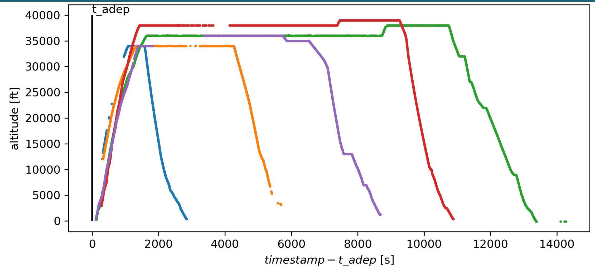

## Trajectory Features: Flight Profile

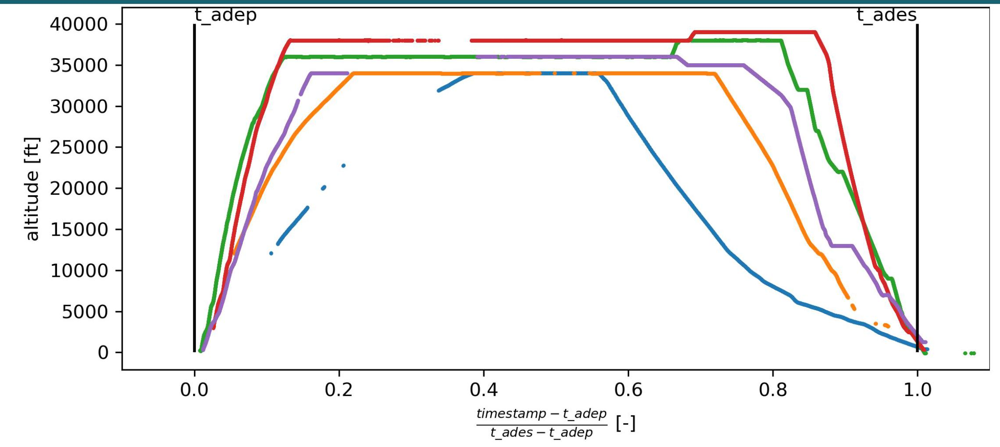

Flight duration \( {t}_{ - } \) ades \( - {t}_{ - } \) adep

## Trajectory Features: Flight Profile

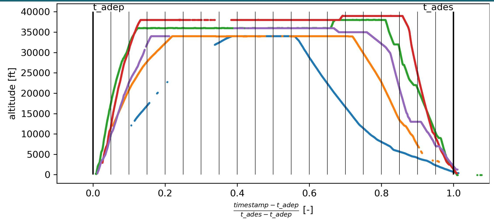

Flight duration \( t \) -ades - \( t \) -adep, and 20 scaled temporal slices along the trajectory, starting from [0,5%] to [95%,100%]

Cardinal (slice) \( {\text{median}}_{i \in  \text{slice }}{\text{altitude}}_{i} \)

\( {\text{median}}_{i \in  \text{slice }}{\text{Mach}}_{i} \) \( {\text{altitude}}_{\text{last}\left( \text{slice}\right) } - {\text{altitude}}_{\text{first}\left( \text{slice}\right) } \)

## Trajectory Features: Flight Profile

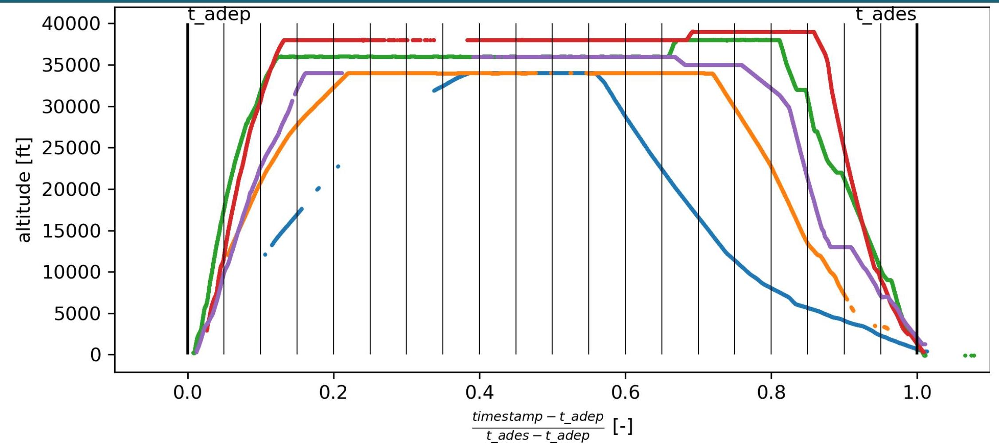

Flight duration \( t \) -ades - \( t \) -adep, and 20 scaled temporal slices along the trajectory, starting from [0,5%] to [95%,100%] Cardinal (slice) - median \( {\mathrm{i \in  {slice}}}_{i} \) altitude \( {}_{i} \) \( {\text{median}}_{i \in  \text{slice }}{\text{Mach}}_{i} \) \( {\text{altitude}}_{\text{last}\left( \text{slice}\right) } - {\text{altitude}}_{\text{first}\left( \text{slice}\right) } \)

This process generates \( 1 + 4 \times  {20} \) features

## Trajectory Features: Climb Phase

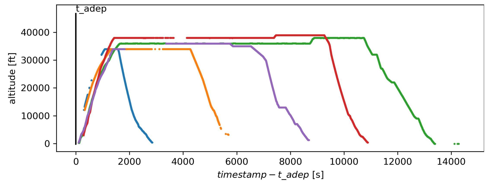

## Trajectory Features: Climb Phase

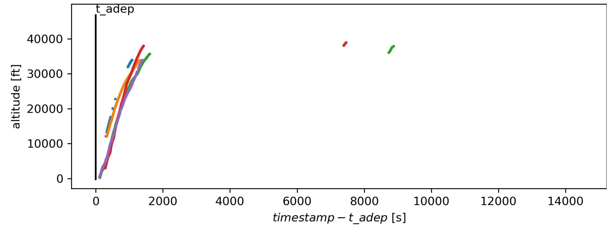

## Trajectory Features: Climb Phase

48 vertical slices starting from [-500ft,500ft] to [46500ft,47500ft] Cardinal (slice) - \( \mathop{\min }\limits_{{i \in  \text{slice}}}{\text{energyrate}}_{i} \)

- median \( {}_{\mathrm{i} \in  \text{ slice }}\Delta {T}_{i} \) - median \( {\mathrm{i}}_{i \in  \text{ slice }}{\mathrm{{energyrate}}}_{i} \) \( {\text{median}}_{i \in  \text{slice }} \) TrueAirSpeed \( {}_{i} \) \( {\mathrm{{max}}}_{\mathrm{i} \in  \mathrm{{slice}}}{\mathrm{{energyrate}}}_{i} \) \( {\text{median}}_{i \in  \text{slice }}{\mathrm{{ROCD}}}_{i} \) \( \mathop{\min }\limits_{{\mathrm{i} \in  \text{ slice }}}{\text{timestamp}}_{i} - {t}_{ - } \) adep \( \mathop{\max }\limits_{j}{ROC}{D}_{j} - \mathop{\min }\limits_{i}{ROC}{D}_{i} \) \( {t}_{ - } \) ades \( - \mathop{\max }\limits_{{\mathrm{i} \in  \text{slice }}} \) timestamp \( {}_{i} \)

\( {\text{median}}_{i \in  \text{slice }}{\text{mass}}_{i} \)

## Trajectory Features: Climb Phase

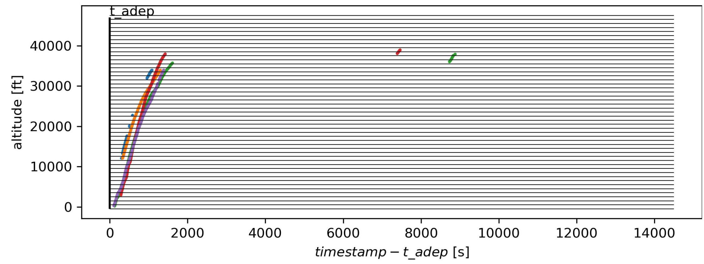

48 vertical slices starting from [-500ft,500ft] to [46500ft,47500ft] Cardinal (slice) - \( \mathop{\min }\limits_{{i \in  \text{slice}}}{\text{energyrate}}_{i} \)

- median \( {}_{\mathrm{i} \in  \text{ slice }}\Delta {T}_{i} \) \( {}^{1}{\text{median}}_{i \in  \text{slice}}\;{\text{energyrate}}_{i} \) \( {\text{median}}_{i \in  \text{slice }} \) TrueAirSpeed \( {}_{i} \) \( {\mathrm{{max}}}_{\mathrm{i} \in  \mathrm{{slice}}}{\mathrm{{energyrate}}}_{i} \) \( {\text{median}}_{i \in  \text{slice }}{\mathrm{{ROCD}}}_{i} \) \( \mathop{\min }\limits_{{\mathrm{i} \in  \text{ slice }}}{\text{timestamp}}_{i} - {t}_{ - } \) adep \( \mathop{\max }\limits_{j}{ROC}{D}_{j} - \mathop{\min }\limits_{i}{ROC}{D}_{i} \) \( {t}_{ - } \) ades \( - \mathop{\max }\limits_{{\mathrm{i} \in  \text{slice }}} \) timestamp \( {}_{i} \) \( {\text{median}}_{i \in  \text{slice }}{\text{mass}}_{i} \) \( \Rightarrow \) Generates \( {11} \times  {48} \) features \( \;7/{11} \)

## Results

Using all these 611 input variables, we have an RMSE of 1,611 kg Improved results through averaging models different random seeds:

- 10 Models (RMSE: 1,564 kg)

- 20 Models (RMSE: 1,561 kg)

## Follow-up: Ablation Study of the Built Features

Which features do the heavy lifting?

- Thunderstorm and fog variables?

- Cruise variables?

General climb variables (ROCD, etc) ?

- Mass estimates?

- Energy rate variables?

## Follow-up: Ablation Study of the Built Features

Which features do the heavy lifting?

- Thunderstorm and fog variables?

Cruise variables?

General climb variables (ROCD, etc) ?

Mass estimates?

Energy rate variables?

<table><tr><td rowspan="2">TS & Fog</td><td rowspan="2">Cruise</td><td colspan="3">Climb</td><td rowspan="2">RMSE [kg]</td></tr><tr><td>Other</td><td>Mass</td><td>energy_rate</td></tr><tr><td>✘</td><td>✘</td><td>✘</td><td>✘</td><td>✘</td><td>3147</td></tr><tr><td>✓</td><td/><td/><td/><td/><td>3147</td></tr><tr><td/><td>✓</td><td/><td/><td/><td>2489</td></tr><tr><td/><td/><td>✓</td><td/><td/><td>1978</td></tr><tr><td/><td/><td/><td>✓</td><td/><td>1936</td></tr><tr><td/><td/><td/><td/><td>✓</td><td>1686</td></tr><tr><td>✓</td><td>✓</td><td>✓</td><td>✓</td><td>✓</td><td>1611</td></tr></table>

## Follow-up: Ablation Study of the Built Features

Which features do the heavy lifting?

- Thunderstorm and fog variables?

Cruise variables?

General climb variables (ROCD, etc) ?

- Mass estimates ?

Energy rate variables?

<table><tr><td rowspan="2">TS & Fog</td><td rowspan="2">Cruise</td><td colspan="3">Climb</td><td rowspan="2">RMSE [kg]</td></tr><tr><td>Other</td><td>Mass</td><td>energy_rate</td></tr><tr><td>✘</td><td>✘</td><td>✘</td><td>✘</td><td>✘</td><td>3147</td></tr><tr><td>✓</td><td/><td/><td/><td/><td>3147</td></tr><tr><td/><td>✓</td><td/><td/><td/><td>2489</td></tr><tr><td/><td/><td>✓</td><td/><td/><td>1978</td></tr><tr><td/><td/><td/><td>✓</td><td/><td>1936</td></tr><tr><td/><td/><td/><td/><td>✓</td><td>1686</td></tr><tr><td>✓</td><td>✓</td><td>✓</td><td>✓</td><td>✓</td><td>1611</td></tr></table>

## Follow-up: Ablation Study of the Built Features

Which features do the heavy lifting?

- Thunderstorm and fog variables?

Cruise variables?

General climb variables (ROCD, etc) ?

- Mass estimates ?

Energy rate variables?

<table><tr><td rowspan="2">TS & Fog</td><td rowspan="2">Cruise</td><td colspan="3">Climb</td><td rowspan="2">RMSE [kg]</td></tr><tr><td>Other</td><td>Mass</td><td>energy_rate</td></tr><tr><td>✘</td><td>✘</td><td>✘</td><td>✘</td><td>✘</td><td>3147</td></tr><tr><td>✓</td><td/><td/><td/><td/><td>3147</td></tr><tr><td/><td>✓</td><td/><td/><td/><td>2489</td></tr><tr><td/><td/><td>✓</td><td/><td/><td>1978</td></tr><tr><td/><td/><td/><td>✓</td><td/><td>1936</td></tr><tr><td/><td/><td/><td/><td>✓</td><td>1686</td></tr><tr><td>✓</td><td>✓</td><td>✓</td><td>✓</td><td>✓</td><td>1611</td></tr></table>

## Follow-up: Ablation Study of the Built Features

Which features do the heavy lifting?

Thunderstorm and fog variables? No !

Cruise variables?

General climb variables (ROCD, etc) ?

- Mass estimates ?

Energy rate variables?

<table><tr><td rowspan="2">TS & Fog</td><td rowspan="2">Cruise</td><td colspan="3">Climb</td><td rowspan="2">RMSE [kg]</td></tr><tr><td>Other</td><td>Mass</td><td>energy_rate</td></tr><tr><td>✘</td><td>✘</td><td>✘</td><td>✘</td><td>✘</td><td>3147</td></tr><tr><td>✓</td><td/><td/><td/><td/><td>3147</td></tr><tr><td/><td>✓</td><td/><td/><td/><td>2489</td></tr><tr><td/><td/><td>✓</td><td/><td/><td>1978</td></tr><tr><td/><td/><td/><td>✓</td><td/><td>1936</td></tr><tr><td/><td/><td/><td/><td>✓</td><td>1686</td></tr><tr><td>✓</td><td>✓</td><td>✓</td><td>✓</td><td>✓</td><td>1611</td></tr></table>

## Follow-up: Ablation Study of the Built Features

Which features do the heavy lifting?

Thunderstorm and fog variables? No !

Cruise variables? Not that much

General climb variables (ROCD, etc) ?

Mass estimates?

Energy rate variables?

<table><tr><td rowspan="2">TS & Fog</td><td rowspan="2">Cruise</td><td colspan="3">Climb</td><td rowspan="2">RMSE [kg]</td></tr><tr><td>Other</td><td>Mass</td><td>energy_rate</td></tr><tr><td>✘</td><td>✘</td><td>✘</td><td>✘</td><td>✘</td><td>3147</td></tr><tr><td>✓</td><td/><td/><td/><td/><td>3147</td></tr><tr><td/><td>✓</td><td/><td/><td/><td>2489</td></tr><tr><td/><td/><td>✓</td><td/><td/><td>1978</td></tr><tr><td/><td/><td/><td>✓</td><td/><td>1936</td></tr><tr><td/><td/><td/><td/><td>✓</td><td>1686</td></tr><tr><td>✓</td><td>✓</td><td>✓</td><td>✓</td><td>✓</td><td>1611</td></tr></table>

## Follow-up: Ablation Study of the Built Features

Which features do the heavy lifting?

Thunderstorm and fog variables? No !

Cruise variables? Not that much

General climb variables (ROCD, etc) ? Yes, somewhat

- Mass estimates?

Energy rate variables?

<table><tr><td rowspan="2">TS & Fog</td><td rowspan="2">Cruise</td><td colspan="3">Climb</td><td rowspan="2">RMSE [kg]</td></tr><tr><td>Other</td><td>Mass</td><td>energy_rate</td></tr><tr><td>✘</td><td>✘</td><td>✘</td><td>✘</td><td>✘</td><td>3147</td></tr><tr><td>✓</td><td/><td/><td/><td/><td>3147</td></tr><tr><td/><td>✓</td><td/><td/><td/><td>2489</td></tr><tr><td/><td/><td>✓</td><td/><td/><td>1978</td></tr><tr><td/><td/><td/><td>✓</td><td/><td>1936</td></tr><tr><td/><td/><td/><td/><td>✓</td><td>1686</td></tr><tr><td>✓</td><td>✓</td><td>✓</td><td>✓</td><td>✓</td><td>1611</td></tr></table>

## Follow-up: Ablation Study of the Built Features

Which features do the heavy lifting?

Thunderstorm and fog variables? No !

Cruise variables? Not that much

General climb variables (ROCD, etc) ? Yes, somewhat

Mass estimates? Yes, somewhat

Energy rate variables?

<table><tr><td rowspan="2">TS & Fog</td><td rowspan="2">Cruise</td><td colspan="3">Climb</td><td rowspan="2">RMSE [kg]</td></tr><tr><td>Other</td><td>Mass</td><td>energy_rate</td></tr><tr><td>✘</td><td>✘</td><td>✘</td><td>✘</td><td>✘</td><td>3147</td></tr><tr><td>✓</td><td/><td/><td/><td/><td>3147</td></tr><tr><td/><td>✓</td><td/><td/><td/><td>2489</td></tr><tr><td/><td/><td>✓</td><td/><td/><td>1978</td></tr><tr><td/><td/><td/><td>✓</td><td/><td>1936</td></tr><tr><td/><td/><td/><td/><td>✓</td><td>1686</td></tr><tr><td>✓</td><td>✓</td><td>✓</td><td>✓</td><td>✓</td><td>1611</td></tr></table>

## Follow-up: Ablation Study of the Built Features

Which features do the heavy lifting?

Thunderstorm and fog variables? No !

Cruise variables? Not that much

General climb variables (ROCD, etc) ? Yes, somewhat

Mass estimates? Yes, somewhat

Energy rate variables? Yes !!

<table><tr><td rowspan="2">TS & Fog</td><td rowspan="2">Cruise</td><td colspan="3">Climb</td><td rowspan="2">RMSE [kg]</td></tr><tr><td>Other</td><td>Mass</td><td>energy_rate</td></tr><tr><td>✘</td><td>✘</td><td>✘</td><td>✘</td><td>✘</td><td>3147</td></tr><tr><td>✓</td><td/><td/><td/><td/><td>3147</td></tr><tr><td/><td>✓</td><td/><td/><td/><td>2489</td></tr><tr><td/><td/><td>✓</td><td/><td/><td>1978</td></tr><tr><td/><td/><td/><td>✓</td><td/><td>1936</td></tr><tr><td/><td/><td/><td/><td>✓</td><td>1686</td></tr><tr><td>✓</td><td>✓</td><td>✓</td><td>✓</td><td>✓</td><td>1611</td></tr></table>

## Conclusion

Predicting TOW with a good accuracy is possible

What Worked ?

Information extracted from climb phase (energy rate !)

- Filtering and smoothing (??) + many slices (??)

<table><tr><td rowspan="2">TS & Fog</td><td rowspan="2">Cruise</td><td colspan="3">Climb</td><td rowspan="2">RMSE [kg]</td></tr><tr><td>Other</td><td>Mass</td><td>energy_rate</td></tr><tr><td>✓</td><td>✓</td><td>✓</td><td>✘</td><td>✘</td><td>1954</td></tr></table>

## Conclusion

Predicting TOW with a good accuracy is possible

What Worked ?

Information extracted from climb phase (energy rate !)

- Filtering and smoothing (??) + many slices (??)

<table><tr><td rowspan="2">TS & Fog</td><td rowspan="2">Cruise</td><td colspan="3">Climb</td><td rowspan="2">RMSE [kg]</td></tr><tr><td>Other</td><td>Mass</td><td>energy_rate</td></tr><tr><td>✓</td><td>✓</td><td>✓</td><td>✘</td><td>✘</td><td>1954</td></tr></table>

Features Not so Useful in our Solution ?

- Thunder and fog at arrival airport

- Cruise features

## Conclusion

Predicting TOW with a good accuracy is possible

What Worked ?

Information extracted from climb phase (energy rate !)

- Filtering and smoothing (??) + many slices (??)

<table><tr><td rowspan="2">TS & Fog</td><td rowspan="2">Cruise</td><td colspan="3">Climb</td><td rowspan="2">RMSE [kg]</td></tr><tr><td>Other</td><td>Mass</td><td>energy_rate</td></tr><tr><td>✓</td><td>✓</td><td>✓</td><td>✘</td><td>✘</td><td>1954</td></tr></table>

Features Not so Useful in our Solution ?

- Thunder and fog at arrival airport

- Cruise features

## Perspective ?

- Is it possible to extract more info from cruise and descent phases?

- A benchmark that will be used by researchers on future study ?!

## Conclusion

Predicting TOW with a good accuracy is possible

What Worked ?

Information extracted from climb phase (energy rate !)

- Filtering and smoothing (??) + many slices (??)

<table><tr><td rowspan="2">TS & Fog</td><td rowspan="2">Cruise</td><td colspan="3">Climb</td><td rowspan="2">RMSE [kg]</td></tr><tr><td>Other</td><td>Mass</td><td>energy_rate</td></tr><tr><td>✓</td><td>✓</td><td>✓</td><td>✘</td><td>✘</td><td>1954</td></tr></table>

Features Not so Useful in our Solution ?

- Thunder and fog at arrival airport

- Cruise features

## Perspective ?

- Is it possible to extract more info from cruise and descent phases?

- A benchmark that will be used by researchers on future study ?!

Thanks to the organizers for this nice data challenge, it has been fun ! :-)

## Thank you for your attention

[Alligier et al., 2013]

Ground-based estimation of aircraft mass, adaptive vs. least squares method.

[Sun et al., 2020]

Openap: An open-source aircraft performance model for air transportation studies and simulations.

## Trajectory features

## Climbing phase

48 vertical slices starting from [-500ft,500ft] to [46500ft,47500ft] For each slice:

Cardinal (slice) - number of points in the slice

- median \( {}_{i \in  \text{ slice }}{\mathrm{{ROCD}}}_{i} \)

\( \mathop{\max }\limits_{j}{ROC}{D}_{j} - \mathop{\min }\limits_{i}{ROC}{D}_{i} \)

\( {\text{median}}_{i \in  \text{slice }} \) TrueAirSpeed \( {}_{i} \)

- median \( {}_{\mathrm{i} \in  \text{ slice }}\Delta {T}_{i} \)

- \( \mathop{\min }\limits_{{i \in  \text{slice energyrate}{i}_{i}}} \)

- median \( {}_{i \in  \text{slice }}{\text{energyrate}}_{i} \)

- max \( {}_{i \in  \text{slice energyrate}{}_{i}} \)

\( \mathop{\min }\limits_{{\mathrm{i} \in  \text{ slice }}}{\text{timestamp}}_{i} - {t}_{ - } \) adep

\( {t}_{ - }{ades} - \mathop{\max }\limits_{{\mathrm{i} \in  \text{ slice }}}{\text{timestamp}}_{i} \)

- median \( {}_{i \in  \text{slice}} \) mass \( {}_{i} \)

## Trajectory features

## Flight profile

20 scaled temporal slices along the trajectory, starting from [0,5%] to [95%,100%] For each slice:

\( {t}_{ - }{ades} - {t}_{ - }{adep} \) - the scaling factor and flight duration

Cardinal (slice) - number of points in the slice

I median \( {}_{i \in  \text{ slice }}{\text{Mach}}_{i} \)

\( {\mathrm{{median}}}_{\mathrm{i} \in  \mathrm{{slice}}}{\mathrm{{altitude}}}_{i} \)

\( {\text{altitude}}_{\text{last}\left( \text{slice}\right) } - \) altitude_first(slice)

## Machine Learning Model

- Theoretical framework: stochastic gradient boosting [1]

- Gradient-boosted regression trees:

- Sum of weak prediction models \( {h}_{m}\left( \mathrm{x}\right)  = {h}_{m - 1}\left( \mathrm{x}\right)  + \nu {t}_{m}\left( \mathrm{x}\right) \) with \( {t}_{m}\left( x\right)  = \mathop{\sum }\limits_{{{R}_{j} \in  {T}_{m}}}{\gamma }_{mj}{\mathbb{1}}_{{R}_{j}}\left( \mathrm{x}\right) \) a small tree

Elements of Statistical Learning (2nd Ed.) c Hastie, Tibshirani & Friedman 2009 Chap 9

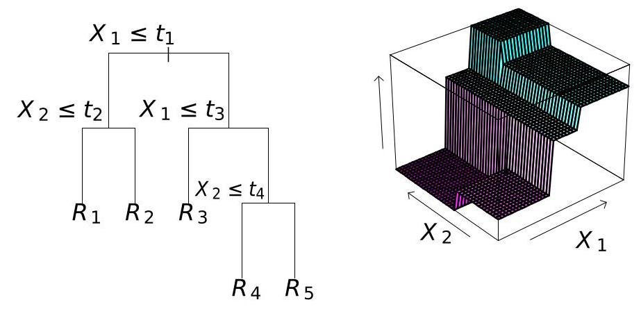

Iterative training: small tree \( {t}_{m}\left( \mathrm{x}\right) \) tuned on residuals of previous model \( {h}_{m - 1} \) , with random sampling

## ADS-B Trajectory Filtering & Smoothing

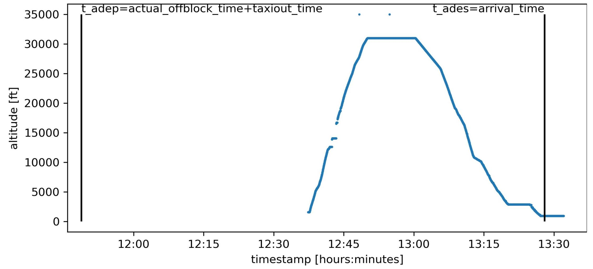

## ADS-B Trajectory Filtering & Smoothing

1 Filtering out repeated measurements

## ADS-B Trajectory Filtering & Smoothing

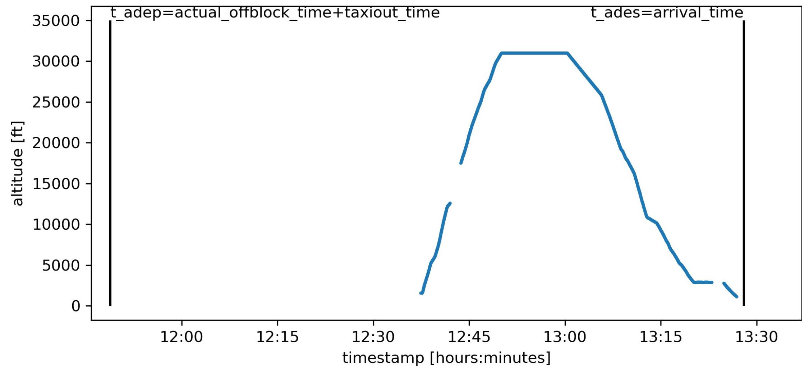

1 Filtering out repeated measurements

2 Filtering out measurements associated with a second order derivative above a threshold

3 Trajectories are smoothed using cubic splines (csaps library)

## ADS-B Trajectory Filtering & Smoothing

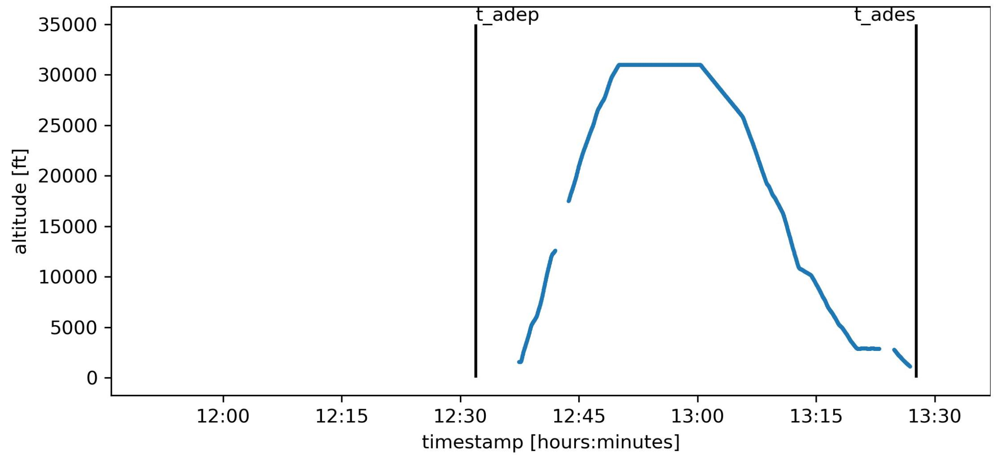

1 Filtering out repeated measurements

2 Filtering out measurements associated with a second order derivative

above a threshold

3 Trajectories are smoothed using cubic splines (csaps library) 4 Correct take-off/landing datetimes

## Follow-up: Ablation Study of the Built Features

Which features do the heavy lifting?

- Thunderstorm and fog, No !

Do cruise variables are that useful ? not that much

- Do mass estimates are that useful ? Yes, somewhat

Do energy rate variables are that useful ? Yes !!

<table><tr><td rowspan="2">TS & Fog</td><td rowspan="2">Cruise</td><td colspan="3">Climb</td><td rowspan="2">RMSE [kg]</td></tr><tr><td>Other</td><td>Mass</td><td>energy_rate</td></tr><tr><td>✓</td><td>✓</td><td>✓</td><td>✓</td><td>✓</td><td>1611</td></tr><tr><td>✘</td><td/><td/><td/><td/><td>1606</td></tr><tr><td/><td>✘</td><td/><td/><td/><td>1610</td></tr><tr><td/><td/><td/><td>✘</td><td/><td>1609</td></tr><tr><td/><td/><td/><td/><td>✘</td><td>1721</td></tr><tr><td>✘</td><td>✘</td><td>✘</td><td>✘</td><td>✘</td><td>3147</td></tr><tr><td>✓</td><td/><td/><td/><td/><td>3147</td></tr><tr><td/><td>✓</td><td/><td/><td/><td>2489</td></tr><tr><td/><td/><td>✓</td><td/><td/><td>1978</td></tr><tr><td/><td/><td/><td>✓</td><td/><td>1936</td></tr><tr><td/><td/><td/><td/><td>✓</td><td>1686</td></tr></table>

