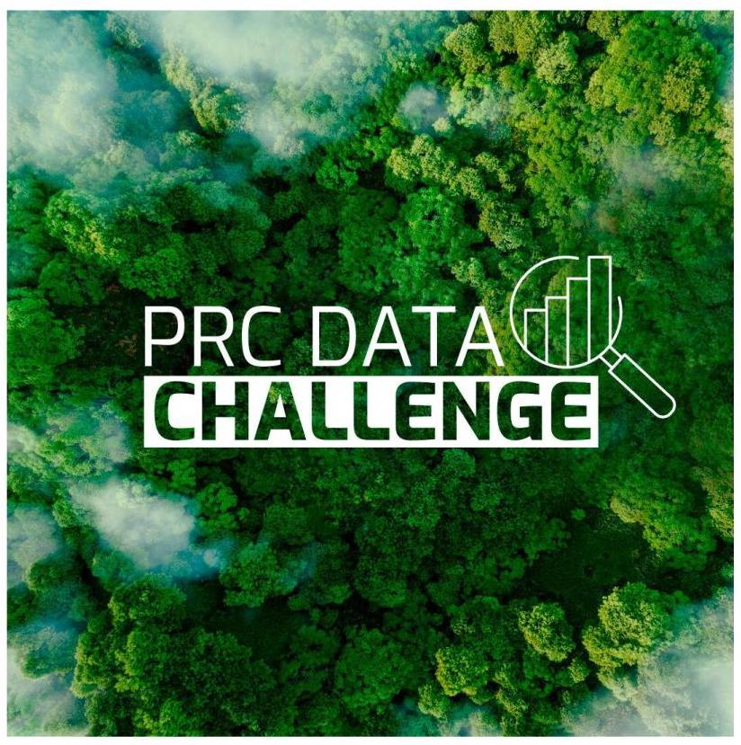
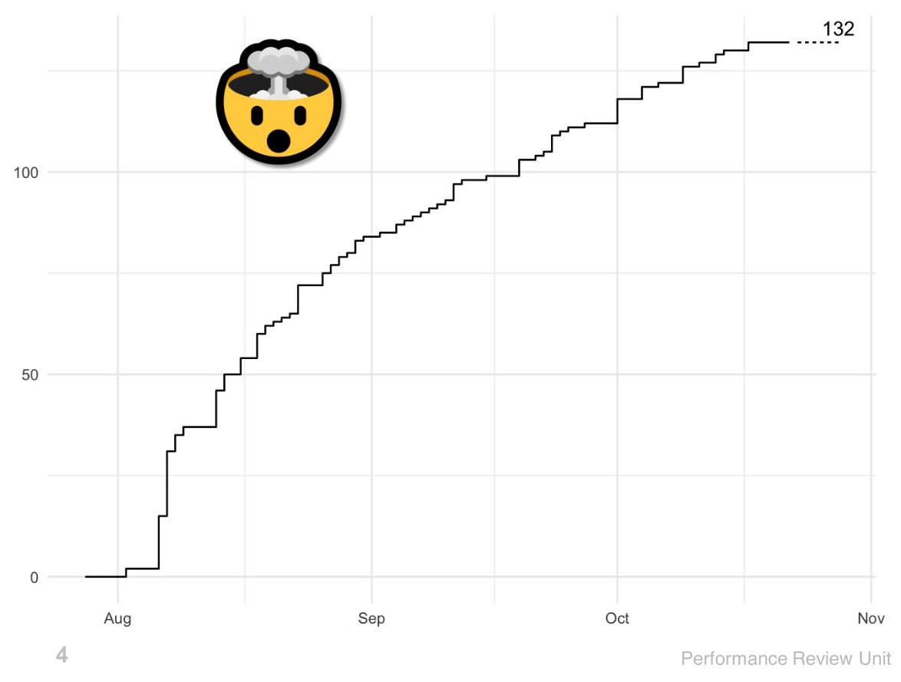
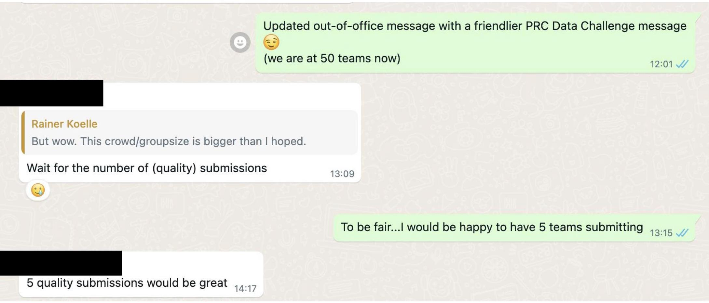
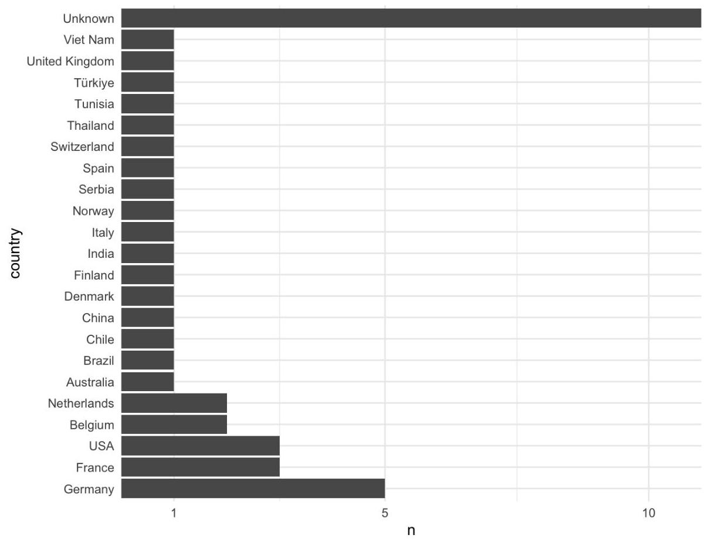

## PRC Data Challenge 2024

Enrico SPINIELLI

EGSD/Aviation Intelligence Unit EUROCONTROL

12th OpenSky Symposium

DLR, Hamburg 8th Nov 2024 Aviation Intelligence Unit / PRU Rue de la Fusée 96, B-1130 Brussels, Belgium www.ansperformance.eu

## Thanks First

- John FITZGERALD: Trino, API

- Junzi SUN: API, trajectory preparation & advise

- Martin STROHMEIER: advise & support

- Allan TART: advise & support

- Quinten GOENS: volunteering and evaluation

- Rainer KOELLE: conception and setup

- Xavier OLIVE: advise & support

- José Miguel de PABLO GUERRERO: institutional (PRC) support

## Why a Data Challenge?

- Curiosity

- Involve Aviation enthusiasts

- But also Data Science enthusiasts (which are probably much more)

- Obtain a model that can be used and trusted in the open

- reproducible reporting / research

- trustable analysis (if other conditions are fulfilled)

- Interesting topic: Actual Takeoff Weight (ATOW)

## Teams

- We were expecting ~10 teams, 2-3 submissions

- We got 132 registered teams (261 members), 43 ranked submissions

- A lot of solo teams

- A lot just interested in accessing the data

## Expectations (14th Aug 2024, 2 weeks from start)

## Submitting teams (43)

## Data preparation

- Contacted 10 airlines: 3 positive to collaborate; Austrian, Swiss and Vueling

- Started from 2022 Flight List from EUROCONTROL's Network Manager with useful TOW info (1_006_051 out of 9.3M)

and passed

flight_id, ICAO 24-bit, callsign, off-block, arrival + 30 min

to extract trajectories from OpenSky Network historical data

(369_013 + 105_959 + 52_190 = 527_162)

- Initial set (158 GiB):

- good/European trajectories + Filter applied

- Later set (250 GiB):

– Same set, i.e. flight_id’s

- No filtering (future: maybe better to pre-filter)

## Submissions

- 34 submissions w/ (average) error ≤5% (9 no publicly shared repo)

- most used method: Gradient Boosting, mainly XGBoost but devil is in the details

- code and docs quality: big variations (even some ChatGPT enhancements;-)

- 5% < 5 submissions ≤ 10% error

- 3% < 16 submissions ≤ 5% error

2% < 17 submissions ≤3% error

1 submission ≤2% error

## What went well and less so (lessons learnt)

- Dedicated website

- Team Registration: via Form rather than email or OSN forum \( \bigoplus  \downarrow \) private API \( \bigoplus \) (ask for affiliation, geographical location, rationale for participation,...)

- Refreshed datasets:

- Flight List, Issue with TOW data

- Trajectories: strange leveled portions

- Interaction with Teams: have a Discord channel \( \rightarrow \) rather than just email

- API: good idea in general \( \Delta \) but got some outages and not easy coordination/reaction between continents \( \sigma \) (teams very tolerant \( \blacksquare \) )

- Airport details (future): add lon/lat directly (no use for teams to do themselves)

甲

- Knowledge (future): more docs on Aviation topics to help Data Science teams

## Future

- Opend the Dataset up: JOAS data paper, data on Zenodo (beginning 2025)

- Public code/docs et al.: https://github.com/prc-data-challenge-2024

- Keep the API/ranking open: can people/teams improve?

- JOAS Special issue for teams to publish their approach: interested?

- Do you have proposals for the next Challenge?

- Fuel consumption profile \( \diamond \) : if ground truth is made openly available \( \angle \)

- Taxi-out time estimation: ?

200MA The Merci Thank you her is the marks in Start Active tensor alamat Cnacn60! Terima kasih 4.5

\( \widetilde{\omega } \sim  \int {\infty }^{o}\widetilde{\omega }{\omega \omega }\left( \omega \right) \) Danke

## Winners: 3rd place team_brave_pillow

TUDelft

TU Delft students

- Aidana Tassanbi

- M. F. Rahman

- Bintang A.S.W.A.M spending voucher 750 EUR

## Winners: 2nd place

## team_tiny_rainbow

Professors and graduate students affiliated with the Aeronautics Institute of Technology (ITA) in Brazil

- Mayara C. R. Murça - João B. T. Szenczuk

- Carolina R. Lima - João P. A. Dantas

- Gabriel A. Melo - Lucas O. Carvalho

- Marcos R. O. A. Máximo

## spending voucher 1750 EUR

## Winners: 1st place

## team_likable_jelly

Professors at Ecole Nationale de l'Aviation Civile (ENAC) Toulouse, France

- Richard Alligier

- David Gianazza