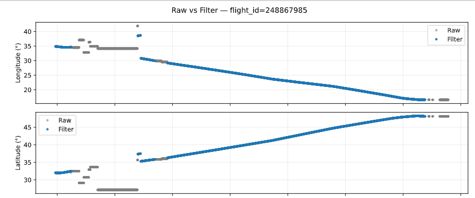
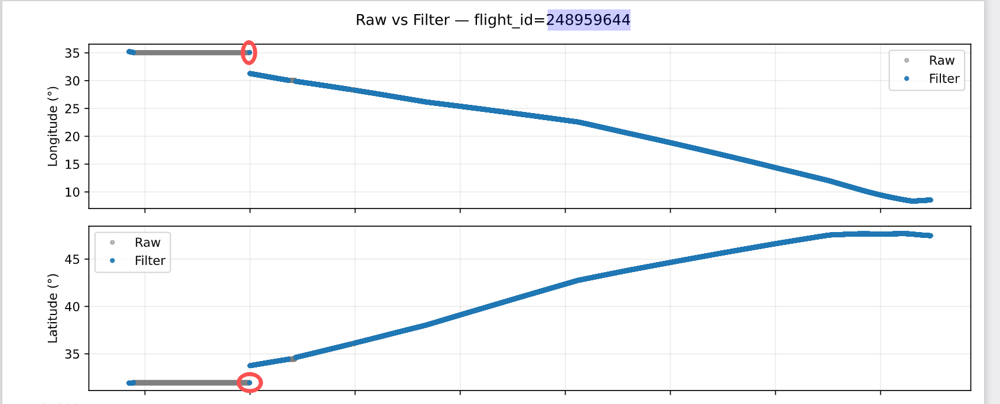

# 有异常漂浮的航迹段落

DATE="${1:-2022-01-07}"
FLIGHT_ID="${2:-248867985}"
引入pca去除

# 难以过滤的边缘离群异常点

DATE="${1:-2022-01-11}"
FLIGHT_ID="${2:-248959644}"
把 FilterMaxSpeedSkipNaN 放在 PCA 后面，直接干掉速度异常的左右两边的点，虽然可能误杀，但是先这样吧


## 根据 jump_events_all.csv 二次清理

清洗后的 `interpolated_clean__PCA_v4` 里仍然会混入极少数异常航迹，可以直接按照人工确认过的 jump report 删除：

```bash
cd clean_segment_pipeline

# 仅统计，确认会删掉哪些航迹
bash run_remove_jump_trajectories.sh --dry-run --day-file interpolated_2022-01-18.parquet

# 真正执行，多进程顺序读写原 parquet（机械盘更友好）
bash run_remove_jump_trajectories.sh --processes 24 --verbose
```

`run_remove_jump_trajectories.sh` 会激活 opensky 环境 → 读取 `reports/quality_check_clean__PCA_v4_manual/jump_detection/jump_events_all.csv` → 多进程按文件过滤，写临时文件后原地覆盖；如果担心性能，可以用 `--limit` 或 `--day-file` 分批跑。

